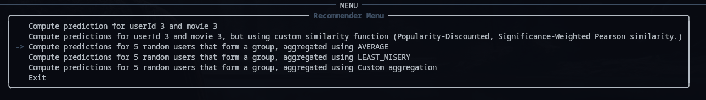

# Recommender Systems

## Part 1

- **a.** DONE
- **b.** Pearson correlation function is implemented in `similarity_functions.py`.
- **c.** Prediction function is implemented in `recommender.py`.
- **d.** Popularity-Discounted, Significance-Weighted Pearson similarity is implemented in `similarity_functions.py`.
  - *Why "Significance-Weighted Pearson similarity"?*  
    It’s useful because it down-weights blockbuster items and shrinks tiny-overlap correlations, so user–user similarities reflect true shared taste and produce steadier recommendations.
- **e.** User-based collaborative filtering for generating groups is implemented in `recommender.py` (`get_predictions_for_group`).  
  The average aggregation method is implemented in `group_aggregation_functions.py`.  
  The Least Misery aggregation method is implemented in `group_aggregation_functions.py`.  
  Both methods are tested in `group_aggregation_pipeline.py`.
- **f.** In the `metric_functions.py` is the implementation of function called "get_disagreements_based_on_order", that is our definition of the disagreement function. And in the `group_aggregation_function.py` there is class "Remove_worst_item_agg", that implements our proposed aggregation function. In the folder `presentations` there is a first presentation as mentioned in the point f.

---
## Part 2
- We propose slight changes to the SIAA see `SIAA` class in `sequence.py`
- 1. We proposed different way of getting the user disagreements for the second part of the formula of SIAA for getting the weights for users. See `get_disagreements_based_on_order` method in `metric_functions.py`, we base this from the assumption that the positions of the movies ranked by the user can be more important than the value of rating itself. This is ofcourse big assumption, because it inherently does not take the values of the rankings into the account, which results in lower performence when evaluating the satisfaction the usual way. (logical)
- 2. We experimented with making parameter `b` of the SIAA more dynamic based on the group disagreements and setting up threshold. See the `dynamicSIAA` class in the `sequence.py`
- 3. We made a presentation see `presentations/Adaptive SIAA.pdf`
- 4. We added `Compute sequential predictions with our proposed method` option to our `python -m Recommender` for trying to run our algorhitm

---
### Installatation tutorial:
- 1. Download the Dataset `ml-latest-small`
- 2. Create and activate the python virtual environment
```console
# linux and mac
python -m venv .venv
source .venv/bin/activate #on linux
# Windows
py -m venv .venv
.\.venv\Scripts\activate
```
- 3. Install the package
```console
pip install .
```
### What to do?
- We have prepared a simple demo, you can run few commands for testing most of the components. This command will run code inside the `Recommender/__main__.py`
```console
python -m Recommender
```
- Currently you should be prompted with this menu:



### Working Dataset Acknowledgment

F. Maxwell Harper and Joseph A. Konstan. 2015. The MovieLens Datasets: History and Context.  
ACM Transactions on Interactive Intelligent Systems (TiiS) 5, 4: 19:1–19:19.  
<https://doi.org/10.1145/2827872>
