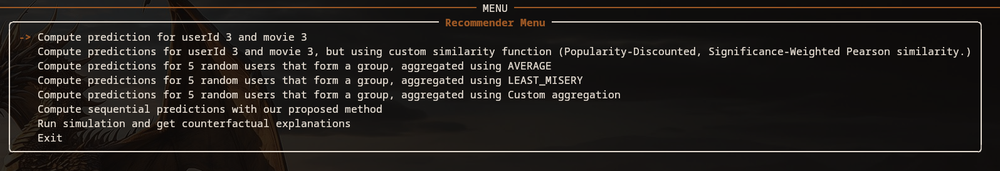

# Recommender Systems

## Part 1

- **a.** DONE
- **b.** Pearson correlation function is implemented in `similarity_functions.py`.
- **c.** Prediction function is implemented in `recommender.py`.
- **d.** Popularity-Discounted, Significance-Weighted Pearson similarity is implemented in `similarity_functions.py`.
  - *Why "Significance-Weighted Pearson similarity"?*  
    It’s useful because it down-weights blockbuster items and shrinks tiny-overlap correlations, so user–user similarities reflect true shared taste and produce steadier recommendations.
- **e.** User-based collaborative filtering for generating groups is implemented in `recommender.py` (`get_predictions_for_group`).  
  The average aggregation method is implemented in `group_aggregation_functions.py`.  
  The Least Misery aggregation method is implemented in `group_aggregation_functions.py`.  
  Both methods are tested in `group_aggregation_pipeline.py`.
- **f.** In the `metric_functions.py` is the implementation of function called "get_disagreements_based_on_order", that is our definition of the disagreement function. And in the `group_aggregation_function.py` there is class "Remove_worst_item_agg", that implements our proposed aggregation function. In the folder `presentations` there is a first presentation as mentioned in the point f.

---
## Part 2
- We propose slight changes to the SIAA see `SIAA` class in `sequence.py`
- 1. We proposed different way of getting the user disagreements for the second part of the formula of SIAA for getting the weights for users. See `get_disagreements_based_on_order` method in `metric_functions.py`, we base this from the assumption that the positions of the movies ranked by the user can be more important than the value of rating itself. This is ofcourse big assumption, because it inherently does not take the values of the rankings into the account, which results in lower performence when evaluating the satisfaction the usual way. (logical)
- 2. We experimented with making parameter `b` of the SIAA more dynamic based on the group disagreements and setting up threshold. See the `dynamicSIAA` class in the `sequence.py`
- 3. We made a presentation see `presentations/Adaptive SIAA.pdf`
- 4. We added `Compute sequential predictions with our proposed method` option to our `python -m Recommender` for trying to run our algorhitm

---
## Part 3
- We propose slight change to MMR diversification method that is used on top of SIAA. Check `SIAADiversification` in `diversification.py`.
- We create custom embeddings from movie genres in order to compare the similarity between movies.
- We compute diversity of list in current round and in previous rounds (so we don't get recommended the same genres from previous rounds) in order to achieve max diversity
- We use new parameter `alpha` to change ratio between diversity in current round and previous rounds
- Check the presentation in `presentations/Diversity MMR.pdf`


---
## Part 4
- All code related to explanations is in the Python package `Recommender/Explanation`.

- Instead of trying to find the exact individual items that would alter the presence of a certain movie in the recommendations, we decided to target **classes of items**. We currently propose three such classes, implemented in `Recommender/Explanation/candidates.py`:

  1. **Decade**
     - We divide movies into decades and, for each decade, compute how popular it is for the group.
     - The candidate list consists of **all movies** that belong to the most popular decade.

  2. **Most agreed items**
     - We find items that are rated by multiple users in the group and compute the variance of their ratings.
     - For simplicity, we choose the **top 5 movies with the lowest variance** (i.e. highest agreement). These movies form the candidate set.

  3. **Most popular genre**
     - We find the most popular genre among the group, based on how often the users rate movies in that genre.
     - The candidates are **all movies belonging to that genre**.

- To test these methods—and especially the way we alter preferences before feeding them into the black-box recommender—we also provide `Recommender/Explanation/explanations_experiments.py`, where we experiment with substituting ratings for certain movies with either `NaN` or `0`.  
  Our interpretation:
  - `NaN` means the movie is **not rated** (no engagement).
  - `0` is treated as if the user would **strongly dislike** the movie.  
  In this sense, a statement like *“If your group hated comedy movies…”* is a valid counterfactual explanation, because it is easy to understand.

- Finally, we test all methods together in `Recommender/Explanation/explanation.py`, where we run the entire pipeline.  
  For each candidate list, we:
  1. Compute recommendations with the modified ratings.
  2. Compare the new aggregated list to the original aggregated list.
  3. For every movie that disappears from the original top-k in the new list, we provide a counterfactual explanation based on how that particular candidate set was constructed.

- We find that our explanation strategies are generally easy to understand, but sometimes produce surprising or not-so-good results. For example, when we removed all movies from the 1990s, we observed that it stopped recommending a movie from the 1930s, which is clearly not an intuitive explanation and may make the user question the system.

- We have added an option in the main program called **“Run simulation and get counterfactual explanations”**. You can run it with:
  ```bash
  python -m Recommender

---

### Installatation tutorial:
- 1. Download the Dataset `ml-latest-small`
- 2. Create and activate the python virtual environment
```console
# linux and mac
python -m venv .venv
source .venv/bin/activate #on linux
# Windows
py -m venv .venv
.\.venv\Scripts\activate
```
- 3. Install the package
```console
pip install .
```
### What to do?
- We have prepared a simple demo, you can run few commands for testing most of the components. This command will run code inside the `Recommender/__main__.py`
```console
python -m Recommender
```
- Currently you should be prompted with this menu:



### Working Dataset Acknowledgment

F. Maxwell Harper and Joseph A. Konstan. 2015. The MovieLens Datasets: History and Context.  
ACM Transactions on Interactive Intelligent Systems (TiiS) 5, 4: 19:1–19:19.  
<https://doi.org/10.1145/2827872>
